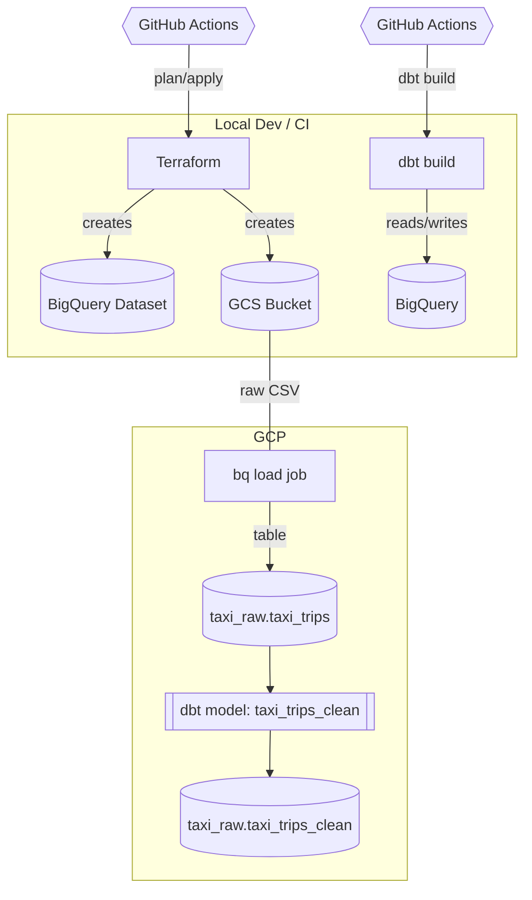

# Mini Data Pipeline (Terraform + GCS + BigQuery + dbt)

A pipeline that lands a CSV in **GCS**, loads it to **BigQuery**, and transforms it with **dbt**. Infra is managed by **Terraform**. CI runs on **GitHub Actions**.

---

## Architecture (high level)



---

## Repo layout

```pgsql
.
├─ terraform/           # IaC for BigQuery dataset + GCS bucket
│  ├─ providers.tf
│  ├─ variables.tf
│  ├─ main.tf
│  └─ terraform.tfvars  # (local only, not committed)
├─ taxi_dbt/            # dbt project
│  ├─ models/
│  │  ├─ test.sql
│  │  └─ taxi_trips_clean.sql
│  └─ dbt_project.yml
└─ .github/workflows/
   ├─ terraform.yml     # plan on PR, apply on main
   └─ dbt.yml           # dbt build on push/PR
```

## Run locally

### Auth & enable APIs (once)
```powershell
gcloud auth application-default login
gcloud config set project astrafy-de-proj
gcloud services enable bigquery.googleapis.com storage.googleapis.com
```

### Terraform for infrastructure
```powershell
cd terraform
terraform init
terraform apply -auto-approve
```

### Put sample data
```powershell
gsutil cp .\taxi_sample.csv gs://<BUCKET>/raw/taxi_sample.csv
bq load --autodetect --source_format=CSV <PROJECT_ID>:taxi_raw.taxi_trips gs://<BUCKET>/raw/taxi_sample.csv
```

### dbt for transformations
```powershell
cd taxi_dbt
dbt build
```
